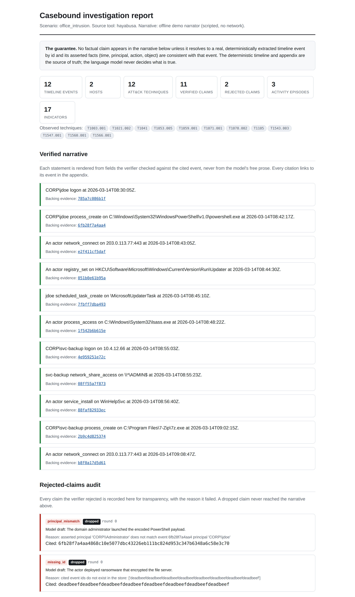
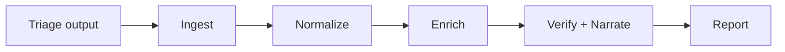
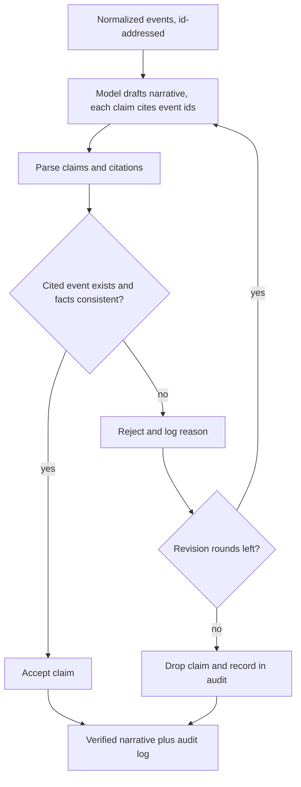

<div align="center">

# Casebound

### The DFIR investigation copilot whose findings cannot outrun the evidence.

Casebound turns raw host triage into a normalized forensic timeline, maps it to MITRE ATT&CK, and then writes an investigation narrative in which every claim is checked against a real event or thrown out before you ever see it.

[](https://github.com/NotACop38/Casebound/actions/workflows/ci.yml)

[](LICENSE)


<br>

<a href="docs/images/report.png"></a>

<sub>The self-contained HTML report, generated offline by <code>casebound demo</code>: a verified narrative whose every claim links to a real event, above the rejected-claims audit that drops and logs what the evidence did not support.</sub>

</div>

-----

## Why Casebound exists

Incident responders already have excellent tools for producing timelines (Plaso, Timesketch, Hayabusa, Chainsaw, the Eric Zimmerman tools, Velociraptor, Dissect). The slow part is turning that pile of artifacts into a defensible account of what happened. The tempting shortcut, letting a language model write the account, is dangerous here: forensic-report hallucination is a documented risk that, in a real case, can turn into a false accusation.

Casebound is not “AI that writes a forensic report.” That already exists. Casebound is the verification layer that makes such output trustworthy. The model proposes the story; a deterministic evidence engine refuses to let any sentence through unless it resolves to a specific event by id and the facts it asserts (time, principal, action, object) match that event. Anything unsupported is revised or dropped, and the rejection is logged for review.

> The deterministic layer is the source of truth. The model is a drafting aid that is fenced by it, and it never has the authority to state a fact.

## The guarantee, in four points

- Every claim is cited. The narrative is a sequence of claims, each carrying one or more event-id citations.
- The verifier rejects ungrounded claims. A claim that cites a missing event, or asserts facts inconsistent with the cited event, never reaches the report.
- It is measured, not asserted. Casebound ships a hallucination trap: a seeded fabricated claim that the verifier must reject. The rejection rate is reported as a first-class number.
- It runs offline. With no model configured you still get the full normalized timeline, ATT&CK tags, activity episodes, and a deterministic findings summary. The narrative is an optional layer that defaults to a local model, so evidence never leaves the host.

## What that looks like

A verified narrative excerpt (each bracketed id links to the evidence appendix in the report):

```text
At 2026-03-04 14:22:07 UTC, winword.exe on HOST-01 spawned powershell.exe with an
encoded command. [evt_3f9c1a]  Ninety seconds later the same host wrote a Run key
referencing the dropped binary, establishing persistence. [evt_7b2e90, evt_7b2e91]
```

The rejected-claims audit, shipped alongside every report:

```text
REJECTED  "The attacker then cleared the Windows event logs to cover their tracks."
  reason  no cited event id; no log-clearing event (Event ID 1102) exists in the timeline
  action  claim dropped, not included in the report
```

That second block is the whole point. The model wanted to write a plausible sentence; the evidence did not support it; Casebound removed it and told you so.

## How it works

The pipeline:



Ingest reads the output of tools you already run. Normalize maps every record into one canonical event with provenance and a UTC timestamp. Enrich tags ATT&CK techniques, clusters activity into episodes, and extracts defanged IOCs. Verify and narrate is the core. Report renders the result.

The verification loop (the generate, test, refine cycle that fences the model):



The model only ever sees a compact, id-addressed view of the events. It never sees raw evidence files, and it never decides what is true.

## Quickstart

```bash
# clone
git clone https://github.com/NotACop38/casebound.git
cd casebound

# install (Python 3.11+)
python -m venv .venv && source .venv/bin/activate
pip install -e .

# run the offline demo on a bundled synthetic intrusion (no API keys required)
casebound demo

# the outputs are written to out/:
#   report.html                 the self-contained hero report
#   report.json, report.md      the same content, machine-readable and ticket-ready
#   attack_navigator_layer.json a MITRE ATT&CK Navigator layer of observed techniques
#   metrics.json                the headline numbers (see the Metrics table below)
```

The demo ingests a synthetic, multi-stage intrusion with known ground truth, builds the timeline, tags ATT&CK, runs the verifier against a local or mocked model, and writes the reports, the Navigator layer, and the metrics, all offline. It prints the metrics and asserts they hit their targets.

## Features

- Verified narrative: every claim cited to a real event, or rejected and logged.
- Local-first: full deterministic timeline and findings with no model; local model default; cloud opt-in behind an explicit flag with a redaction pass.
- One canonical timeline: a single normalized schema across all sources, UTC-normalized, with a raw reference on every event for audit.
- MITRE ATT&CK mapping and a Navigator heatmap of observed techniques.
- Activity episodes and structured, defanged IOC extraction.
- A self-contained HTML report (no external fetches at view time), plus JSON and Markdown.
- Optional Timesketch export to plug into existing team workflows.
- A synthetic intrusion generator and a one-command offline demo, no API keys.

## Architecture

A single Python package with firm module boundaries, each independently testable:

|Module     |Responsibility                                                          |
|-----------|------------------------------------------------------------------------|
|`ingest`   |One adapter per source; emits raw rows with provenance                  |
|`normalize`|The canonical event schema, field mappers, UTC timezone handling        |
|`enrich`   |ATT&CK tagging, episode clustering, IOC extraction                      |
|`verify`   |Claims parser, field-consistency checks, the generate-test-refine engine|
|`narrate`  |The provider-agnostic model interface and the drafting loop             |
|`report`   |HTML, JSON, and Markdown renderers; ATT&CK Navigator layer              |
|`generate` |The synthetic evidence generator and scenario definitions               |
|`cli`      |The command surface (ingest, normalize, analyze, report, demo, generate)|
|`web`      |Optional FastAPI viewer: browse the timeline and report (reuses `report`)|

See <docs/PRD.md> for the full design and <docs/verification.md> for the claim and citation contract.

## Metrics

Regenerated by `casebound demo` from a clean clone, with no keys:

|Metric                      |What it measures                                                 |Target                               |
|----------------------------|-----------------------------------------------------------------|-------------------------------------|
|Hallucination-rejection rate|Seeded fabricated claims the verifier refuses                    |1.0 on the seeded set                |
|Citation accuracy           |Emitted claims whose citations resolve to real, consistent events|1.0 by construction                  |
|ATT&CK tagging precision    |Correct technique tags over all emitted tags                     |at least 0.9 on the showcase scenario|
|ATT&CK tagging recall       |Labeled techniques detected                                      |at least 0.7 on the showcase scenario|
|Technique coverage          |Distinct techniques observed in the Navigator layer              |reported                             |

A citation accuracy below 1.0 is a verifier bug, by design.

## Ingestion sources

|Source                           |Mode        |Status              |
|---------------------------------|------------|--------------------|
|Hayabusa (CSV)                   |tool output |MVP                 |
|Eric Zimmerman / KAPE (CSV)      |tool output |MVP                 |
|Generic CSV (column-mapped)      |tool output |MVP                 |
|Chainsaw                         |tool output |implemented         |
|Velociraptor, Plaso              |tool output |implemented         |
|EVTX, NTFS $MFT (via Dissect)    |raw artifact|optional, license-gated (`pip install "casebound[raw]"`)|
|Registry and other artifacts     |raw artifact|planned             |

Casebound normalizes and reasons; it does not reinvent artifact parsing. It stands on the parsers responders already trust. Raw mode (parsing EVTX and the NTFS `$MFT` directly with Dissect) is optional and isolated: Dissect is AGPL-3.0, so it is an opt-in extra kept off the core import path so the core stays Apache-2.0. See `docs/raw-mode.md`.

## Defensive scope and non-goals

- Read-only analysis of evidence that has already been collected. Casebound never performs acquisition that modifies an endpoint, never collects remotely, and never takes remediation or containment action.
- No detonation, no sandboxing, no execution of suspect binaries.
- Evidence never leaves the host by default. Any cloud-model path is opt-in, gated by an explicit flag, and preceded by a redaction pass.
- The repository ships synthetic or public sample evidence only. No real case data.
- Casebound is not an EDR, a SIEM, an acquisition tool, or a malware sandbox. It assists a qualified analyst; it does not replace one.

## Prior art and acknowledgments

Casebound is built on, and grateful to, the open DFIR ecosystem: SigmaHQ, Hayabusa (Yamato Security), Chainsaw (WithSecure Labs), the Eric Zimmerman tools, Velociraptor, Plaso and Timesketch, Dissect (Fox-IT, NCC Group), and MITRE ATT&CK and the Navigator.

On the AI side, credit to the teams shipping AI-assisted DFIR triage (for example AIFT by FlipForensics) and to the academic work documenting language-model hallucination in forensic reporting and timeline analysis. Casebound’s contribution is a different one: a provable grounding mechanism and its public measurement, with a deterministic core that needs no model at all.

## Roadmap

The build runs vertical-slice-first. See <docs/ENGINEERING_CHECKLIST.md> for the phased plan with exit criteria.

1. Vertical slice: one source, end to end, including the verifier and the hallucination trap.
1. Breadth: more ingestion sources, each with fixtures and golden tests.
1. Depth: episode clustering, IOC extraction, all report formats, the metrics.
1. Cloud path and offline guarantees, with redaction and the no-model path proven.
1. Security invariants and the threat model.
1. README and visual polish.
1. Raw-artifact mode via Dissect (optional, license-gated).
1. Optional web UI.
1. Community readiness and the v0.1.0 release.

## Optional web UI

A minimal, opt-in viewer to browse the timeline and read the report in a browser. It reuses the report layer unchanged, so the page it serves is identical to the report the CLI writes. It is offline and loopback-only: it fetches nothing at view time, makes no outbound connection, and never opens or executes an upload. The server dependencies live in the opt-in `web` extra, off the default import graph.

```bash
pip install -e ".[web]"   # FastAPI plus uvicorn, none of it in the core install
make web                  # serve on http://127.0.0.1:8000 (or: python -m web)
```

Open `/` for the loaded cases, `/cases/demo/timeline` to browse, and `/cases/demo/report` for the full report. Upload a Hayabusa CSV to load your own timeline (size- and type-limited, parsed read-only). See `web/README.md`.

## Contributing

Adding an ingestion source should take an afternoon: write an adapter, a fixture, and a normalization golden test. See `CONTRIBUTING.md` and `docs/authoring.md`. Every change to the verifier must ship with both a grounded-accept and a fabricated-reject test.

## License

Apache-2.0 for the core. Note: the optional raw-artifact mode depends on Dissect, which is AGPL-3.0, and is kept isolated (an opt-in `raw` extra, confined to `casebound/ingest/raw`, off the core import path, enforced by a test) so the core license stays permissive. Installing the `raw` extra and using raw mode assembles a combined work subject to AGPL-3.0. See `docs/raw-mode.md` and `docs/PRD.md` (decision D2) for the details.

<div align="center">

Built with Claude Code and Codex. No em dashes were harmed in the making of this repository.

</div>