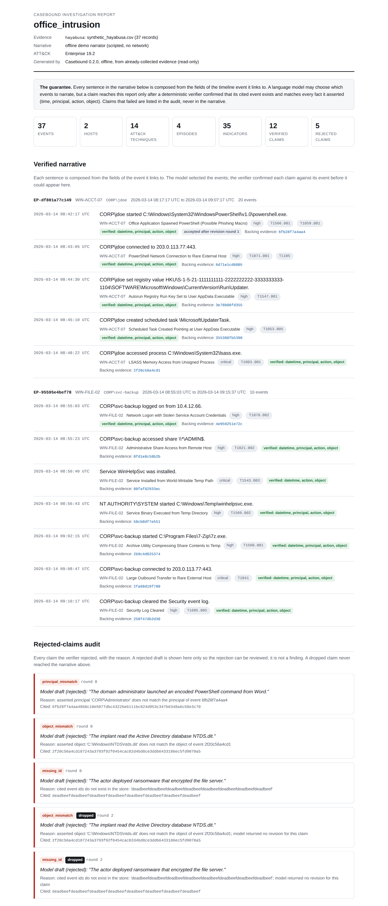
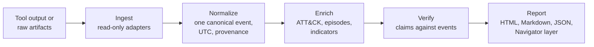
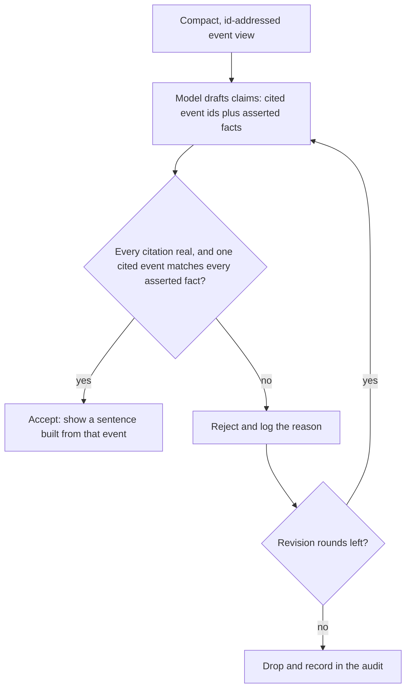

<div align="center">

# Casebound

**Offline DFIR case reports whose narrative is verified, claim by claim, against the evidence timeline.**

[](https://github.com/NotACop38/Casebound/actions/workflows/ci.yml)

[](LICENSE)


<a href="docs/images/report.png"></a>

<sub>The report <code>casebound demo</code> writes, offline, for a synthetic two-host intrusion. Every sentence in the narrative is composed from the event it links to; the model's rejected drafts are listed underneath with the reason each one failed.</sub>

</div>

Casebound reads the output of the DFIR tools responders already run (Hayabusa, Chainsaw, the Eric Zimmerman tools, Velociraptor, Plaso, or any CSV) and, optionally, raw `.evtx` and `$MFT` artifacts. It normalizes everything into one UTC timeline, tags MITRE ATT&CK techniques, groups activity into episodes, extracts indicators, and writes a self-contained report. A language model can draft the narrative, but a deterministic verifier checks every claim against the timeline first, and the reader only ever sees sentences built from the evidence itself.

## Why

Writing up an investigation is slow. Letting a language model write it is fast and dangerous: a model produces plausible sentences whether or not the evidence supports them, and in an investigation an unsupported sentence is a false finding. Casebound gives the model the part it is good at, deciding which events tell the story, and takes away the part it cannot be trusted with, stating facts.

## The guarantee

- **Every claim cites evidence.** The model answers in a fixed JSON format: the ids of the events a claim rests on, and the facts it asserts (time, principal, action, object).
- **Every claim is checked.** A claim survives only if every citation resolves to a real event and one cited event matches every asserted fact. Failures go back to the model with the reason; whatever still fails is dropped and logged.
- **The reader sees the evidence, not the model.** Each surviving claim is shown as a sentence composed from its event's own fields and linked to the full record. The model's own wording appears only in the rejected-claims audit.
- **It is measured.** A benchmark derives fabricated and grounded claims from every event of a case and requires zero false accepts and zero false rejects, and the test suite proves the benchmark catches a deliberately weakened verifier.
- **It is local-first.** No model is required. Nothing leaves the host by default, and a cloud model is opt-in and sees only redacted events.

## Quickstart

```bash
git clone https://github.com/NotACop38/Casebound.git
cd Casebound
python -m venv .venv && source .venv/bin/activate
pip install -e .
casebound demo
```

The demo regenerates the bundled synthetic intrusion, analyzes it, has a scripted offline stand-in for a model draft the narrative (no network, no keys), verifies every claim, writes the reports to `out/`, and scores itself:

```text
read 37 record(s) from synthetic_hayabusa.csv (hayabusa)
normalized 37 event(s)
tagged 14 ATT&CK technique(s), formed 4 episode(s), extracted 35 indicator(s)
narrative from offline demo narrator (scripted, no network): 12 claim(s) verified, 5 rejection(s) logged, 2 dropped
wrote out/report.html
wrote out/report.md
wrote out/report.json
wrote out/events.jsonl
wrote out/attack_navigator_layer.json
wrote out/metrics.json
verifier benchmark:
  fabricated claims rejected: 495/495 (false accepts: 0)
  grounded claims accepted:   296/296 (false rejects: 0)
  narrative citation accuracy: 1.00 (12/12)
ATT&CK tagging, end to end: precision 1.00, recall 1.00 (14 correct, 0 false positive(s), 0 missed)
ATT&CK tagging, table only: precision 0.62, recall 0.57 (8 correct, 5 false positive(s), 6 missed)
verification guarantee held on every measured claim
```

The stand-in narrator makes three mistakes a real model plausibly makes: it attributes the PowerShell launch to the domain administrator, claims the implant read `NTDS.dit` while citing the LSASS event, and invents a ransomware event. The verifier rejects all three; the misattribution is corrected in the next round and accepted, and the other two are dropped. The demo exits non-zero if the verifier misjudges a single claim.

## Analyze your own evidence

Name each evidence file as `SOURCE:PATH`. One run can mix any sources into one case, and records describing the same observation collapse into one event that keeps every source record as provenance.

```bash
casebound report hayabusa:timeline.csv -o out
casebound report hayabusa:timeline.csv chainsaw:hunt.json velociraptor:evtx.jsonl -o out --name "ACME triage"
casebound report generic_csv:edr_export.csv --column-map edr.map.json -o out
```

| Output | Contents |
| --- | --- |
| `report.html` | The report: the verified narrative, the rejected-claims audit, an ATT&CK matrix, activity episodes, indicators, the timeline, and an evidence appendix with every event's full record. Self-contained: nothing is fetched when it opens. |
| `report.md` | The same content for a ticket or a chat, with evidence neutralized so it cannot inject markup or links, and indicators defanged. |
| `report.json` | The same content, machine-readable, always with every event. |
| `events.jsonl` | The normalized timeline, one canonical event per line ([schema](docs/schema.md)). |
| `attack_navigator_layer.json` | The observed techniques, scored by event count, for the [ATT&CK Navigator](https://mitre-attack.github.io/attack-navigator/). |

With no model configured, the report is fully deterministic. In place of the narrative it lists the key findings: every event that exhibits an ATT&CK technique or that its detection rule rated high or critical, phrased and linked the same way.

### Supported inputs

| Source | Input | File types |
| --- | --- | --- |
| `hayabusa` | Hayabusa `csv-timeline` (any profile) or `json-timeline` | `.csv`, `.json`, `.jsonl` |
| `chainsaw` | Chainsaw `hunt` detections written with `--json` | `.json` |
| `eztools` | MFTECmd `$MFT` CSV from KAPE triage | `.csv` |
| `velociraptor` | `Windows.EventLogs.Evtx` results exported as JSONL | `.jsonl`, `.json` |
| `plaso` | `psort` l2tcsv super timeline | `.csv` |
| `generic_csv` | Any delimited CSV, described by a [column map](docs/ingest-generic-csv.md) | `.csv` |
| `evtx`, `mft` | Raw Windows event logs and NTFS `$MFT`, parsed with Dissect ([raw mode](docs/raw-mode.md)) | needs `pip install -e ".[raw]"` |

`casebound sources` prints this list. Hayabusa's abbreviated channels and field names are expanded per channel and EventID, and Windows events from every source map through one shared EventID table, so the same event reads the same whichever tool produced it.

### Add a narrative

The recommended model runs on your own machine. Any OpenAI-compatible server works: Ollama (the default endpoint, `http://localhost:11434/v1`), llama.cpp, vLLM, or LM Studio.

```bash
pip install -e ".[local]"
export CASEBOUND_PROVIDER=local CASEBOUND_LOCAL_MODEL=llama3.1   # any model your server serves
casebound report hayabusa:timeline.csv -o out
```

The model receives a compact view of each event (id, time, host, principal, action, object, summary, ATT&CK techniques, severity), never raw evidence, for at most 300 events per case (`--view-budget`), ATT&CK-tagged and severe events first. Claims are still verified against every event.

Cloud providers need explicit consent on every run (`--allow-cloud`) and receive a redacted view, with the summary, the principal, and indicators and usernames stripped:

| Provider | Install | Configuration |
| --- | --- | --- |
| Local | `pip install -e ".[local]"` | `CASEBOUND_PROVIDER=local`, `CASEBOUND_LOCAL_MODEL`, optionally `CASEBOUND_LOCAL_BASE_URL` |
| Anthropic | `pip install -e ".[anthropic]"` | `CASEBOUND_PROVIDER=anthropic`, `ANTHROPIC_API_KEY`; the model defaults to `claude-opus-5` |
| OpenAI | `pip install -e ".[openai]"` | `CASEBOUND_PROVIDER=openai`, `OPENAI_API_KEY`, `CASEBOUND_OPENAI_MODEL` |

Each provider requests JSON constrained to the published [claim schema](casebound/data/claims.schema.json) where the API supports it. The Anthropic provider streams its responses and opts into server-side refusal fallbacks, since security evidence is exactly what a safety classifier may flag. Keys never appear in reports, logs, or error messages. [`.env.example`](.env.example) documents every setting.

### Check claims written anywhere

The verifier does not care who drafted a claim. `casebound verify` checks a claims file from another tool, another model, or a person against a case's `events.jsonl`, and exits non-zero if any claim is rejected:

```console
$ casebound verify claims.json --events out/events.jsonl --out verdicts.json
ACCEPT  CORP\jdoe started C:\Windows\System32\WindowsPowerShell\v1.0\powershell.exe. [6fb28f7a4aa4]
REJECT  The domain administrator launched PowerShell.
        principal_mismatch: asserted principal 'CORP\Administrator' does not match the principal of event 6fb28f7a4aa4
1 of 2 claim(s) verified against 37 event(s)
wrote verdicts.json
```

## How it works


```mermaid
flowchart LR
  A["Tool output or<br>raw artifacts"] --> B["Ingest<br>read-only adapters"]
  B --> C["Normalize<br>one canonical event,<br>UTC, provenance"]
  C --> D["Enrich<br>ATT&CK, episodes,<br>indicators"]
  D --> E["Verify<br>claims against events"]
  E --> F["Report<br>HTML, Markdown, JSON,<br>Navigator layer"]
```

- **Ingest** reads evidence without modifying or executing anything and keeps a pointer from every record back to its source file.
- **Normalize** maps each record to the [canonical event](docs/schema.md): a UTC time with the original preserved, host, principal, action, object, and a content-derived `event_id`. A row that parses but cannot be normalized (an impossible timestamp, say) is listed in the report rather than dropped.
- **Enrich** tags ATT&CK techniques, clusters events into episodes (one actor's run of activity on one host), and extracts defanged indicators. Detection tools' own rule tags are validated against a bundled ATT&CK Enterprise 19.2 catalog, and an id MITRE has since revoked is translated to its successor with the original kept: a rule's `T1070.001` becomes `T1685.005`. Sources without detection rules (raw event logs, Plaso, file-system timelines, generic CSV) are tagged by a small, documented mapping table.
- **Verify** runs the loop below. **Report** renders the case; the HTML, Markdown, and JSON reports draw from one content model, so they cannot disagree.


```mermaid
flowchart TD
  E["Compact, id-addressed event view"] --> M["Model drafts claims: cited event ids plus asserted facts"]
  M --> V{"Every citation real, and one cited event matches every asserted fact?"}
  V -->|"yes"| K["Accept: show a sentence built from that event"]
  V -->|"no"| R["Reject and log the reason"]
  R --> L{"Revision rounds left?"}
  L -->|"yes"| M
  L -->|"no"| X["Drop and record in the audit"]
```

The full contract, including the claim format, the comparison rules, and every rejection reason, is in [docs/verification.md](docs/verification.md).

## Measured results

From `casebound demo`, on the bundled scenario:

| Measure | Result | Target |
| --- | --- | --- |
| Fabricated claims rejected, across 14 fabrication classes | 495 of 495 | every one |
| Grounded claims accepted, across 8 spelling variants | 296 of 296 | every one |
| Narrative citation accuracy | 12 of 12 | 1.00 |
| ATT&CK tagging, end to end | precision 1.00, recall 1.00 | at least 0.9 and 0.7 |
| ATT&CK tagging, mapping table alone | precision 0.62, recall 0.57 | reported |

What these numbers do and do not show:

- The fabrication classes include a nonexistent or truncated citation, a time just outside the one-second tolerance, a swapped principal, action, or object, a Unicode look-alike path, a claim stitched from two events, and a true claim carrying one bad extra citation. The grounded variants include re-cased values, a non-UTC offset for the same instant, and a subset of the fields.
- The scenario is synthetic (37 detections, 12 of them the attack). On it, end-to-end tagging mostly confirms that detection-rule tags pass through faithfully and revoked ids are translated. The table-only row is the honest measure of what Casebound infers on its own: it labels behavior, not intent, so a benign OneDrive Run key or a Defender read of LSASS looks like an attack to it.
- The verifier guarantees that each sentence matches the event it cites. It does not guarantee that the model chose the right events, or that the evidence is complete.

## Web viewer

An optional local viewer lists cases, browses a case's timeline, and serves its report. It runs the same pipeline and renderer as the command line, binds to loopback, and fetches nothing. Uploads of Hayabusa, Chainsaw, EZTools, Velociraptor, or Plaso output are size- and type-checked and parsed read-only.

```bash
pip install -e ".[web]"
casebound serve                 # http://127.0.0.1:8000
```

See [docs/web-viewer.md](docs/web-viewer.md).

## Scope

Casebound analyzes evidence that has already been collected, read-only. It never acquires from or modifies an endpoint, never collects remotely, never executes anything it reads, and never remediates. It is not an EDR, a SIEM, an acquisition tool, or a sandbox, and it supports an analyst's judgment rather than replacing it. These limits are enforced by tests that scan the package for process-execution and network primitives, and that run the library, the evidence-reading commands, and the web viewer with outbound connections blocked; see [SECURITY.md](SECURITY.md) and the [threat model](docs/threat-model.md).

## Development

```bash
make install    # editable install plus the pinned toolchain
make ci         # the gate
make demo       # the pipeline end to end, scored
```

The gate runs ruff, strict mypy, 580+ tests (including property-based tests of the verifier) under a 93% coverage floor, JSON Schema validation, a style check, detect-secrets, bandit, and pip-audit. CI runs it on Python 3.11, 3.12, and 3.13. New ingestion sources are the most common contribution and are designed to take an afternoon: see [CONTRIBUTING.md](CONTRIBUTING.md) and [docs/authoring.md](docs/authoring.md).

| Module | Responsibility |
| --- | --- |
| `ingest` | One read-only adapter per source; `ingest/raw` holds the optional Dissect adapters |
| `sources` | The registry of input formats, used by the CLI and the viewer |
| `normalize` | The canonical schema, per-source mappers, UTC handling, severity |
| `enrich` | ATT&CK tagging against the bundled catalog, episodes, indicators |
| `verify` | The claim parser, the field checks, and the revision loop |
| `narrate` | Model providers, the prompt, cloud redaction, the offline demo narrator |
| `pipeline` | `analyze`: evidence in, one `Case` out, for every entry point |
| `report` | The shared report model, sentence phrasing, and every output format |
| `evaluation` | The verifier benchmark and the ATT&CK scores |
| `generate` | The synthetic scenario and its ground truth |
| `web` | The optional viewer |

## Documentation

- [docs/verification.md](docs/verification.md): the claim format, the checks, and how the guarantee is measured
- [docs/schema.md](docs/schema.md): the canonical event and its identity
- [docs/authoring.md](docs/authoring.md): add an ingestion source
- [docs/ingest-generic-csv.md](docs/ingest-generic-csv.md): map any CSV with a column map
- [docs/raw-mode.md](docs/raw-mode.md): raw EVTX and `$MFT` parsing, and the license boundary
- [docs/web-viewer.md](docs/web-viewer.md): the optional viewer and its upload hardening
- [docs/threat-model.md](docs/threat-model.md) and [SECURITY.md](SECURITY.md): scope, threats, and enforcement
- [docs/PRD.md](docs/PRD.md) and [docs/ENGINEERING_CHECKLIST.md](docs/ENGINEERING_CHECKLIST.md): requirements, decisions, and build history
- [CHANGELOG.md](CHANGELOG.md)

## Acknowledgments

Casebound stands on the open DFIR ecosystem: Hayabusa (Yamato Security), Chainsaw (WithSecure Labs), SigmaHQ, the Eric Zimmerman tools, Velociraptor, Plaso and Timesketch, Dissect (Fox-IT, part of NCC Group), and MITRE ATT&CK and the ATT&CK Navigator. Among AI-assisted DFIR tools, AIFT (FlipForensics) does local triage and report generation; Casebound's contribution is narrower: a verification mechanism for model-written narrative, and a public measurement of it.

## License

Apache-2.0. The optional raw mode depends on Dissect, which is AGPL-3.0. It is an opt-in extra confined to `casebound/ingest/raw` and loaded only when an operator selects a raw source, so the core never loads AGPL code (enforced by `tests/test_license_boundary.py`). Installing the `raw` extra and using raw mode creates a combined work subject to AGPL-3.0; see [docs/raw-mode.md](docs/raw-mode.md).
